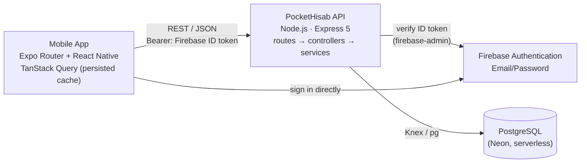
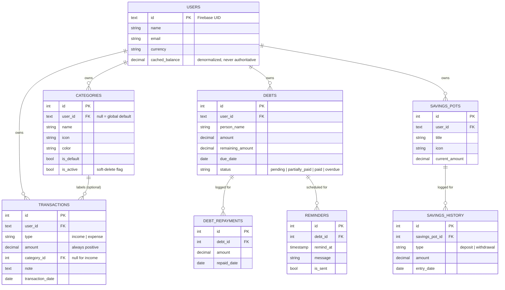

<div align="center">

# 💰 PocketHisab

**Your Money, Always Accounted For**

A full-stack personal-finance tracker — a Node.js/Express REST API and an offline-first
Expo mobile app — built to answer one question at a glance: *where does my money stand
right now*, while also tracking who owes what, and what's been set aside.

[](pocket-hisab)
[](pocket-hisab)
[](#-database)
[](pocket-hisab-mobile-app)
[](pocket-hisab-mobile-app)
[](#-architecture)
[](#-license)

</div>

---

## 🔗 Live Demo

| | Link |
|---|---|
| 📑 API / Swagger Docs | [https://pockethisab-gdic.onrender.com/docs](https://pockethisab-gdic.onrender.com/docs) |
| ⚙️ API base URL | `https://pockethisab-gdic.onrender.com/api/v1` |
| 🤖 Android App (APK) | *Not published yet* |

## 📖 Overview

PocketHisab ("Hisab" — accounts, reckoning) is a banking-app-style ledger for everyday
money management. It's one backend, one client:

- **API** (`pocket-hisab`) — a single Express service, the source of truth for every
  derived number (Total Balance, a debt's status) — nothing is ever trusted as a
  client-supplied value.
- **Mobile app** (`pocket-hisab-mobile-app`) — the daily-driver experience: instant
  from-cache startup, optimistic writes, and full offline usability, built on Expo Router
  and TanStack Query.

## ✨ Features

**Money tracking**
- 💵 "Add Money" / "Spend Money" logging in one action, with a live running Total Balance
  computed straight from the ledger — never a stored value that can drift
- 🧮 Balance is always `SUM(income) − SUM(expense)`; a cached column exists purely as an
  optimization and is never trusted as authoritative
- 🏷️ Default + user-created **categories** with icon/color, per-category spend history and
  totals, soft-deleted so historical transactions never lose their label
- 📊 History grouped by day, filterable by day/month/year and free-text search, with a
  category breakdown for the period
- 📤 Export transaction history as CSV or PDF, or a full JSON backup of everything you own

**Debts**
- 🤝 Track money owed to others: amount, due date, notes
- 💸 Log partial or full repayments — the ledger of repayments is the only thing that ever
  changes a debt's remaining balance, so the numbers can't drift out of sync
- 🚦 Automatic status — `pending` → `partially_paid` → `paid`, with `overdue` **derived at
  read time** (not written by a background job), so it's always correct even though the
  server has no cron/scheduler
- ⏰ Per-debt reminders (date + message) for the mobile app to act on

**Savings**
- 🏦 Manually tracked savings pots (Emergency Fund, a trip, anything) with deposit/withdrawal
  history — **fully independent of Total Balance** by design, so putting money "aside"
  never double-counts it as spent

**Accounts & security**
- 🔐 Firebase Authentication (Email/Password) — the API never stores a password, only
  verifies the Firebase ID token on every request and auto-provisions a local profile the
  first time an account is seen
- 🧾 Every response uses one consistent envelope: `{ success, data, error, meta }`

**Client experience**
- ⚡ **Offline-first, not just offline-tolerant** — every screen renders instantly from a
  disk-persisted query cache; every write applies optimistically and queues automatically
  while offline, then syncs the moment the device reconnects — no custom sync engine, all
  built on TanStack Query's own network-aware query/mutation lifecycle
- 🔍 Opening something you can already see in a list (a debt, a pot) renders instantly even
  offline, seeded from the list's own cache instead of waiting on a request that was never
  made
- 🎨 Light / Dark / System mode, plus five selectable accent color themes, both persisted
  on-device
- 📱 A calculator-style numeric keypad and bottom-sheet flow for Add/Spend Money

## 🏗️ Architecture



- **Identity is entirely Firebase's job.** The client authenticates directly with Firebase;
  the API only verifies the resulting ID token and auto-provisions a matching `users` row
  on first sight — there is no `/register` or `/login` endpoint on the API itself.
- **The API is the single source of truth** for every computed value — Total Balance and a
  debt's effective status are always derived server-side from the ledger.

## 🧰 Tech Stack

| | Backend (`pocket-hisab`) | Mobile (`pocket-hisab-mobile-app`) |
|---|---|---|
| Language | JavaScript (Node.js 22) | TypeScript |
| Framework | Express 5 | Expo SDK 54 + Expo Router |
| Data | PostgreSQL (Neon) via Knex.js | TanStack Query (persisted cache) |
| Auth | `firebase-admin` (token verification) | `firebase` JS SDK (sign-in) |
| Validation | Zod | Zod (form input) |
| UI | — | Custom design system, `@gorhom/bottom-sheet` |
| Docs | OpenAPI 3.1 via `swagger-ui-express` | — |
| Deployment | Render (Web Service) | EAS (build config present, not yet published) |

## 📂 Monorepo Structure

```
PocketHisab/
├── pocket-hisab/                    # Express REST API
│   ├── index.js                     # process entrypoint
│   ├── knexfile.js                  # Knex CLI config
│   └── src/
│       ├── app.js                   # Express app: middleware + route wiring
│       ├── config/                  # env, Firebase Admin init
│       ├── db/                      # shared Knex instance, migrations/, seeds/
│       ├── middleware/              # auth, validation, pagination, logging, errors
│       ├── utils/                   # ApiError, response envelope, CSV export, logger
│       ├── validators/              # one Zod schema file per resource
│       ├── routes/ · controllers/ · services/   # one file per resource, per layer
│       └── docs/                    # OpenAPI spec source (served at /docs)
│
└── pocket-hisab-mobile-app/         # Expo React Native app
    ├── app/                          # file-based routes (expo-router)
    │   ├── (auth)/                    # login, register, forgot-password
    │   ├── (tabs)/                     # Home, History, Debts, Savings, Settings
    │   ├── categories/                   # category management + per-category history
    │   ├── debt/[id].tsx                   # debt detail — repayments, reminders
    │   └── savings-pot/[id].tsx              # pot detail — deposit/withdrawal history
    └── src/
        ├── api/                   # typed fetch client + one endpoint file per resource
        ├── auth/                    # Firebase init, AuthProvider
        ├── query/                     # QueryClient/persister + one hook file per resource
        ├── theme/                        # light/dark/system + 5 accent color themes
        ├── components/                     # design-system primitives + feature components
        ├── types/api.ts                       # TS mirrors of the backend's response shapes
        └── utils/                                # currency/date formatting, error messages
```

## 🔌 API Reference

Full interactive docs (request/response schemas, "Try it out") are served at
**`/docs`** once the backend is running. Summary:

| Method | Endpoint | Description |
|---|---|---|
| `GET` `PATCH` | `/auth/me` | Current authenticated user's profile |
| `GET` | `/balance` | Total Balance, computed live from the ledger |
| `GET` | `/dashboard/summary` | Today / this month / this year income vs. expense |
| `GET` | `/dashboard/recent-activity` | Last N transactions, category included |
| `GET` `POST` | `/transactions` | List (filterable/searchable) / create |
| `GET` `PATCH` `DELETE` | `/transactions/{id}` | Read, edit, or delete one transaction |
| `GET` | `/transactions/summary` · `/summary/by-category` | Aggregated totals by period / by category |
| `GET` `POST` | `/categories` | List available categories / create a custom one |
| `PATCH` `DELETE` | `/categories/{id}` | Edit or soft-delete a custom category |
| `GET` `POST` | `/debts` | List (filterable by status) / create |
| `GET` `PATCH` `DELETE` | `/debts/{id}` | Read (with repayment history), edit, or delete |
| `GET` `POST` | `/debts/{id}/repayments` | Repayment history / log a repayment |
| `GET` | `/debts/upcoming` | Debts due within the next N days |
| `GET` `POST` | `/reminders` | List / create a reminder for a debt |
| `PATCH` `DELETE` | `/reminders/{id}` | Edit or cancel a reminder |
| `GET` `POST` | `/savings-pots` | List (with total saved) / create a pot |
| `GET` `PATCH` `DELETE` | `/savings-pots/{id}` | Read (with history), edit, or delete |
| `GET` `POST` | `/savings-pots/{id}/entries` | Deposit/withdrawal history / add an entry |
| `GET` | `/export/transactions?format=csv\|pdf` | Export transaction history |
| `GET` | `/export/full-backup` | Full JSON backup of everything a user owns |

Every route requires `Authorization: Bearer <Firebase ID token>`.

## 🗄️ Database



A debt's `overdue` status is never stored as final — it's the effective status returned by
the API, recomputed on every read from `remaining_amount` and `due_date`, since "the due
date has passed" can become true with no write ever happening.

## 🚀 Getting Started

### Prerequisites

- [Node.js](https://nodejs.org/) 22+
- A PostgreSQL database (e.g. a free [Neon](https://neon.tech/) instance)
- A [Firebase](https://firebase.google.com/) project with Email/Password sign-in enabled
- [Expo Go](https://expo.dev/go) app (for quick mobile testing) or Android Studio / Xcode
  for a native build

### 1. Backend

```bash
cd pocket-hisab
npm install
cp .env.example .env   # fill in the values below
npm run migrate         # creates all 8 tables
npm run seed              # inserts the default categories
npm run dev
```

<details>
<summary>Required environment variables</summary>

| Variable | Description |
|---|---|
| `DATABASE_URL` | Postgres connection string (Neon) |
| `FIREBASE_PROJECT_ID` `FIREBASE_CLIENT_EMAIL` `FIREBASE_PRIVATE_KEY` | Firebase **service account** (Console → Project Settings → Service Accounts → Generate new private key) — different from the client-side config used by the mobile app |
| `PORT` | Port to listen on |
| `NODE_ENV` | `development` or `production` |
| `CORS_ORIGIN` | Allowed origins, comma-separated (`*` for local dev) |

</details>

Swagger UI: `http://localhost:<PORT>/docs`.

### 2. Mobile app

```bash
cd pocket-hisab-mobile-app
npm install
# set EXPO_PUBLIC_API_BASE_URL in .env to your backend (local IP, or the live Render URL)
npx expo start
```

Scan the QR code with **Expo Go** to run it instantly on a physical device, or press `a`
for an Android emulator / `w` for web.

## 🗺️ Roadmap

- [ ] Actual local push notifications from reminder data (currently stored, not yet
      scheduled on-device)
- [ ] Google Sign-In
- [ ] Android production build via EAS
- [ ] Pagination UI for very long transaction/debt histories
- [ ] Multi-currency support beyond a per-user display preference

## 📄 License

No license has been published for this project yet — all rights reserved by the author.
Reach out if you'd like to use or build on it.

---

<div align="center">

Built by **[Farhan](https://github.com/Farhan0140)**

</div>
